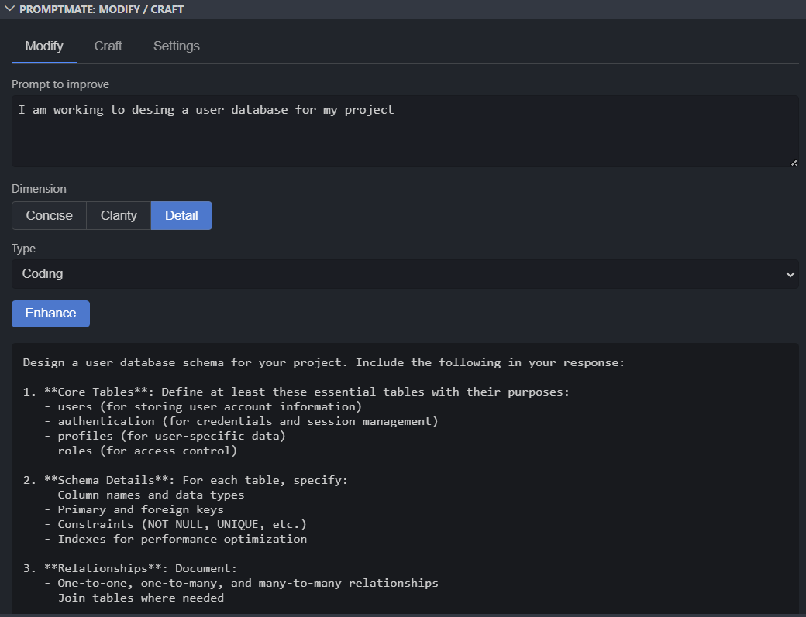
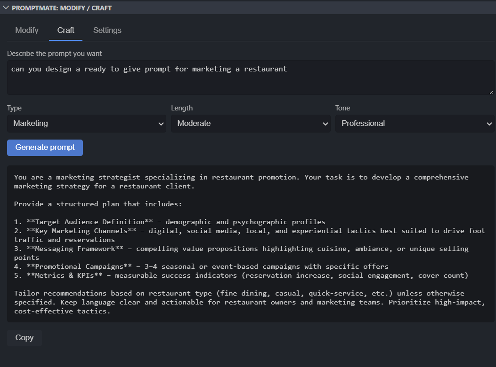
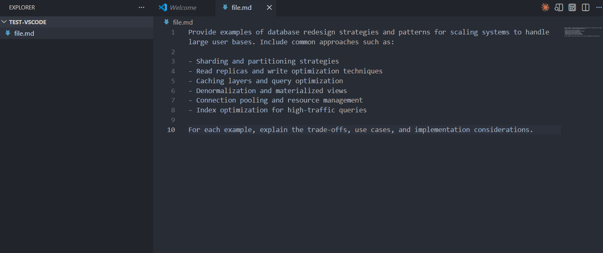

<div align="center">
  
  <h1>PromptChef AI Enhancer</h1>
  <p><strong>Thinks before you send.</strong><br/>
  Turn vague prompts into clear, well-specified ones — right inside VS Code.</p>

  
  
</div>

---

## What it does

You write a rough prompt. PromptChef rewrites it — making it more concise, clearer, or more detailed — depending on what you need. It streams the result directly into your editor so you can see it improving in real time.

No copy-pasting. No switching tabs. Just better prompts, faster.

---

## Features

| | |
|---|---|
| ⚡ **Instant enhance** | Press `Ctrl+Shift+E` to rewrite the selected text (or whole file) in place |
| 🎛️ **Three modes** | **Concise** — trim it down · **Clarity** — improve structure · **Detail** — expand with specifics |
| ✍️ **Craft from scratch** | Describe what you need and generate a polished prompt from a blank slate |
| 🔄 **Streams live** | See the rewrite appear word-by-word, just like a chat interface |
| ↩️ **One-key undo** | The entire rewrite is a single undo stop — `Ctrl+Z` brings the original back instantly |
| 🔌 **Works with any model** | VS Code built-in models (Copilot, Claude) · Anthropic · OpenAI · Gemini · self-hosted proxy |
| 🔒 **Key stays safe** | API keys are stored in the OS keychain (SecretStorage), never in `settings.json` |

---

## Quick Start

### Use the panel

**Step 1 — Click the PromptChef icon** in the Activity Bar (left sidebar) to open the panel.

**Step 2 — Modify tab:** paste any prompt, pick a dimension (Concise / Clarity / Detail) and a domain type, then hit **Enhance**. The improved prompt appears below with a Copy button.



**Step 3 — Craft tab:** describe what you want in plain English, choose a length and tone, then hit **Generate prompt** to create one from scratch.




### Enhance text in your editor

**Step 1 — Open any file** with a prompt or description you want to improve.

**Step 2 — Select the text** you want to rewrite (or select nothing to rewrite the whole file).

**Step 3 — Press `Ctrl+Shift+E`** (Mac: `Cmd+Shift+E`). The rewrite streams in immediately.



---

If you're using VS Code with Copilot or Claude already installed, both flows work with **no configuration and no API key**.

---

## Three ways to use it

### 1 — Keyboard shortcut (fastest)

| Shortcut | Action |
|---|---|
| `Ctrl+Shift+E` | Enhance using the default mode |
| `Ctrl+Shift+Alt+E` | Pick a mode first (Concise / Clarity / Detail) |

### 2 — Status bar button

Click **✨ Enhance** in the bottom-right status bar. While running, it shows a spinner so you always know it's working.

### 3 — The PromptChef panel

Click the PromptChef icon in the **Activity Bar** (left sidebar) to open the panel. It has two tabs:

#### Modify tab
Paste or type any prompt, choose a dimension and domain type, then hit **Enhance**. The result appears below with a **Copy** button.

```
┌─────────────────────────────────────┐
│  Prompt to improve                  │
│  ┌───────────────────────────────┐  │
│  │ write me a function that...   │  │
│  └───────────────────────────────┘  │
│                                     │
│  Dimension  [Concise] Clarity Detail│
│  Type       [Coding ▼]              │
│                                     │
│  [ Enhance ]                        │
│                                     │
│  ╔═══════════════════════════════╗  │
│  ║ Write a function that accepts ║  │
│  ║ an array of integers and...   ║  │
│  ╚═══════════════════════════════╝  │
│  [ Copy ]                           │
└─────────────────────────────────────┘
```

#### Craft tab
Describe the prompt you want in plain English. Choose a type, length, and tone — PromptChef generates a ready-to-use prompt from scratch.

---

## Provider setup

### Option A — No key needed (default)

If you have **GitHub Copilot** or **Claude for VS Code** installed, PromptChef uses it automatically. Set the provider to `VS Code model` in Settings and you're done.

### Option B — Your own API key

1. Open the PromptChef panel → **Settings** tab
2. Choose your provider (Anthropic, OpenAI, or Gemini)
3. Enter the model ID you want to use
4. Paste your API key and click **Save key**

The key is stored in the OS keychain and never written to any file.

### Option C — Self-hosted / proxy

Set the provider to **Proxy**, enter your endpoint URL (OpenAI-compatible format), and optionally add a key.

---

## Settings reference

All settings live under `promptmate.*` in VS Code Settings (`Ctrl+,`):

| Setting | Default | Description |
|---|---|---|
| `provider` | `vscode-lm` | Which model to use (`vscode-lm`, `anthropic`, `openai`, `gemini`, `proxy`) |
| `model` | `claude-haiku-4-5-20251001` | Model ID for the selected provider |
| `defaultMode` | `refine` | Mode used by the quick shortcut (`concise`, `refine`, `detail`) |
| `defaultType` | `coding` | Domain the rewrite is tailored toward |
| `streamIntoEditor` | `true` | Stream deltas live into the editor, or apply the full result at once |
| `proxyUrl` | _(empty)_ | Endpoint URL when provider is `proxy` |

**Finding model IDs:**
- Anthropic — [docs.anthropic.com/en/docs/about-claude/models](https://docs.anthropic.com/en/docs/about-claude/models/overview)
- OpenAI — [platform.openai.com/docs/models](https://platform.openai.com/docs/models)
- Gemini — [ai.google.dev/gemini-api/docs/models](https://ai.google.dev/gemini-api/docs/models)

---

## Requirements

- VS Code **1.90** or later
- For `vscode-lm`: GitHub Copilot or another chat model extension installed
- For `anthropic` / `openai` / `gemini`: a valid API key for that provider

---

## Commands

All commands are available in the Command Palette (`Ctrl+Shift+P`):

| Command | Description |
|---|---|
| `PromptChef: Enhance Prompt` | Rewrite selection using the default mode |
| `PromptChef: Enhance Prompt (choose mode…)` | Pick Concise / Clarity / Detail first |
| `PromptChef: Open Panel` | Open the Modify / Craft sidebar panel |
| `PromptChef: Set API Key…` | Store an API key securely |
| `PromptChef: Clear Stored API Key` | Remove the stored key |

---

## License

MIT © [Aditya Sahani](https://github.com/sahaniaditya)
